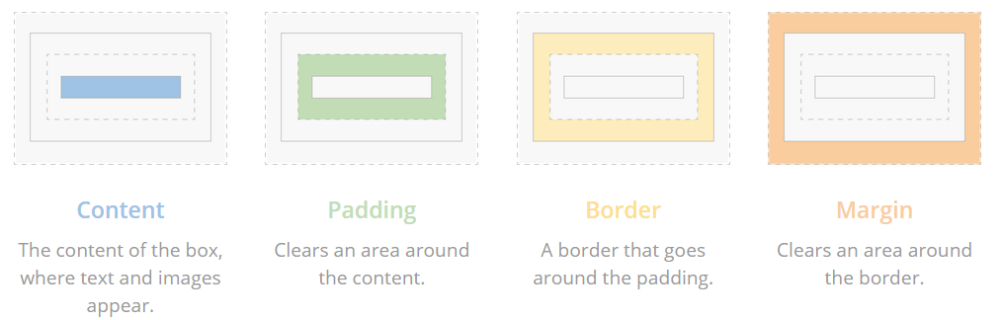
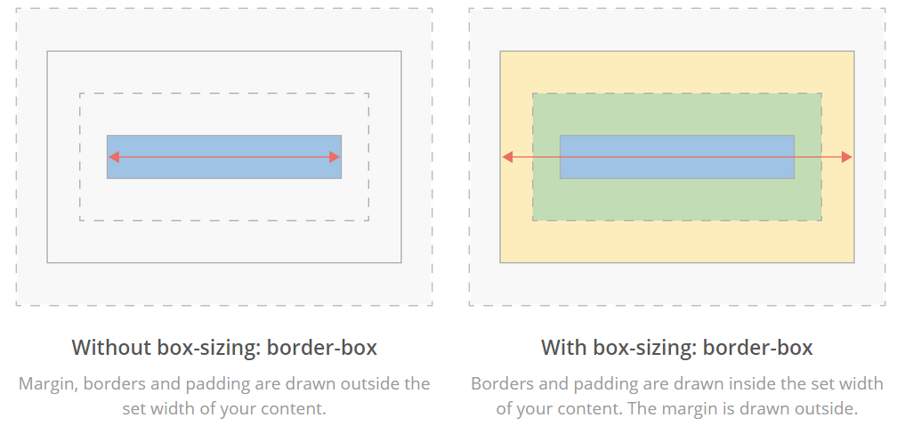

# Basics of HTML and CSS

# HTML

#####Topics:#####
* HTML tag syntax
* Basic HTML tags
* New HTML 5 tags

#####Materials#####

* [WebPlatform](http://docs.webplatform.org/wiki/html/tutorials)
* [Slides Intro](nuriasuarez.github.io/htmlcss-topic0/html-intro/slides.html)
* [HTML Validator](http://validator.w3.org/)

#####More Documentation#####
* [W3Schools.com](http://www.w3schools.com/html/default.asp)

#####Exercises#####
* [Exercise 1 - Basic HTML](http://nuriasuarez.github.io/htmlcss-topic0/html-intro/exercise/exercise1.html)
* [Exercise 2 - Basic Page](http://nuriasuarez.github.io/htmlcss-topic0/html-intro/exercise/exercise2.html)
* [Exercise 3 - Structure and Form](http://nuriasuarez.github.io/htmlcss-topic0/html-intro/exercise/exercise3.html)
 
#####Optional Exercises#####
* [Code Academy](http://www.codecademy.com/tracks/web): It is a site that contains interactive courses on how to program

# CSS

#####Topics:#####
* Introduction to selectors
* Introduction to Specificity
* CSS Units

#####Materials#####

###### Selectors and properties

* [Brief of CSS selectors](http://www.sitepoint.com/web-foundations/css-selectors/)
* [Slides selectors](http://estelle.github.io/selectors/#slide1)

###### CSS Units
* [Video](http://www.sitepoint.com/css3-rem-units/)

###### Specificity
* [Learn about CSS Specificity (basically how the rules override others)](http://www.w3.org/TR/CSS21/cascade.html#specificity)

#####More Documentation#####

###### Selectors and properties
* [CSS3 selectors sheet](http://www.w3.org/TR/css3-selectors/)
* [Play a little game to consolidate your knowledge](http://flukeout.github.io/)
* [Bookmark the following list of properties for future reference](http://ref.openweb.io/CSS/)
* [Bookmark a reference of CSS Vocabulary](http://pumpula.net/p/apps/css-vocabulary/)

###### CSS Units
* [CSS Concepts Common Units of Measurement - Video] (http://www.dailymotion.com/video/x242ej5_2-0-css-fundamentals-common-css-concepts-common-units-of-measurement_lifestyle)
* [Which CSS Measurements To Use When](http://demosthenes.info/blog/775/Which-CSS-Measurements-To-Use-When)
* [Learning to love the boring bits of CSS] (http://alistapart.com/article/love-the-boring-bits-of-css)

#####Exercises#####
* [Selectors Exercise](http://nuriasuarez.github.io/htmlcss-topic0/cssexersice/exercise1.html)
 
#####Optional Exercises#####

###### Specificity
* [Experiment specificity right now using CSS3 selectors](http://specificity.keegan.st/)

#####Practice:#####

* Now add classes to the different HTML tags with the following names:
    * To &lt;header&gt;  add class .header
    * To &lt;footer&gt;  add class .footer
    * To &lt;section&gt;  add class .content
    * To &lt;nav&gt;  add class  .navigation
    * To &lt;aside&gt;  add class  .sidebar
* Using the new added classes figure out how to override:
    * .header must define a font-size: 46px;
    * .footer must define a font-size: 10px;
    * .content must define a font-size: 14px;
    * .navigation must define a font-size: 12px;
    * .sidebar must define a font-size: 10px;
* If the class attribute finish with **r (example header, footer)**, the background must be magenta.
* If the class attribute contain an **a (example nav)** but do NOT finish with r, the background must be blue.
* How could you add weight to the global font definition to override all the overrides provided by point c?
* Imagine you have something like class=”oh-no-inline-styles” style=”background:red” and you should change the background to green but without changing the inline style, How could you accomplish this?

### CSS Layout

[Learn CSS fundamentals that are used in any website's layout] (http://learnlayout.com/)

#### The Box Model

* [Learn about the Box Model (how the browser calculate boxes size)](http://www.w3.org/TR/CSS21/box.html)
  * [Play with it here changing width / margin / padding / box-sizing](http://dabblet.com/gist/2986528)
* [How to alter the box model calculations](http://quirksmode.org/css/user-interface/boxsizing.html)
* [Extra about box-sizing](http://adamschwartz.co/magic-of-css/chapters/1-the-box/)
  * Use the playground provided above to change *box-sizing* and see the changes.

#####Practice:#####
* Modify your own webpage so that it looks like this one: http://foundation.zurb.com/templates/feed.html (only desktop)

### Responsive Web Design

[A simple guide to responsive web design] (http://www.adamkaplan.me/grid/)

####Media Queries

[Learn Media Queries](http://css-tricks.com/css-media-queries/)

#####See more:#####
* [A collection of inspirational websites using media queries and responsive web design] (http://mediaqueri.es/)
* [Media Queries Bookmarklet] (http://seesparkbox.com/foundry/media_query_bookmarklet)

#####Practice:#####
* Adapt your own webpage to be ready for different devices.
